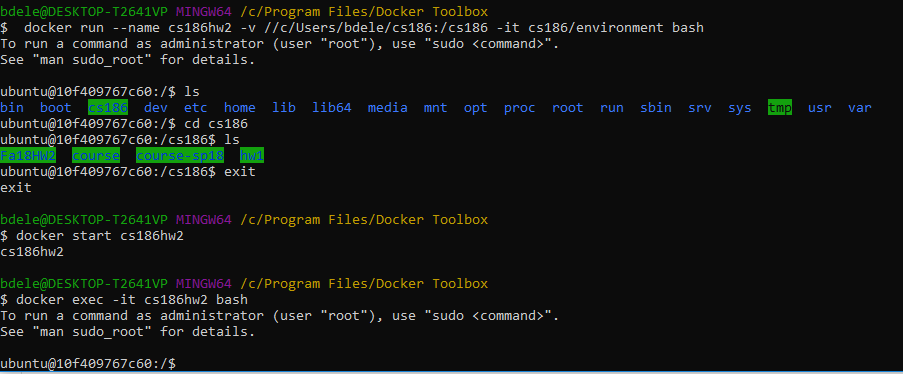

# Homework 2: B+ Trees
**Due 11:59 PM Wednesday, September 26**

## Overview
In this assignment, you will implement persistent B+ trees in Java. In this
document, we explain

- how to fetch the release code from GitHub,
- how to test your code using the docker container
- what code you have to implement.

## Step 0: Fetching the Assignment and Setup
To avoid redownloading our maven dependencies every time we start our docker conatiner, we will start our docker container a little differently than in HW1. The first time you work on this homework run the following command:
```
docker run --name cs186hw2 -v <pathname-to-directory-on-your-machine>:/cs186 -it cs186/environment bash
```
The only difference in this command from the one we used in HW1 is that we give the container a name. Make sure you can access your shared drive as in HW1, then exit out of the container (just run `exit`). Now startup your container again with the following command:
```
docker start cs186hw2
```
The only thing that should happen is the terminal should print cs186hw2. After running those 2 commands once, to open your container in the future the only command you need to run is:
```
docker exec -it cs186hw2 bash
```

After completing these steps, your terminal should look something like this:


While inside your container, navigate to the shared directory you created in the hw1 setup: 
```
cd cs186
```  

Clone the HW2 repo: 
```
git clone https://github.com/berkeley-cs186/Fa18HW2.git
```
If you get an error like: `Could not resolve host: github.com`, try restarting your docker machine (run `docker-machine restart` after exiting the docker container), and if that doesn't work restart your entire computer. 

cd into the folder you just created: 
```
cd Fa18HW2
```

To test everything downloaded correctly run: 
```
mvn clean compile
```

To test your project implementation, run:
```
mvn clean test
```

If you haven't implemented anything, about 20 tests should fail and the bottom of your output should look something like this: 


If a few additional tests fail try running the command again. If the problem persists then make a post on piazza.

Before submitting your assignment you must run `mvn clean test` and ensure it works in the docker container. We will not accept "the test ran in my IDE" as an excuse. You should be running the maven tests periodically as you work through the project.

## Step 1: Setup your development environment
You are free to use any text editor or IDE to complete the project, but **we
will build and test your code in the docker container with maven**.

We recommend setting up a more local development environment by installing Java 8 (the version our Docker container runs) and using an IDE such as Eclipse or IntelliJ. Note that if you have another version of Java installed on your computer it is probably fine to run that as long as you don't use any Java 9/10 features, but be sure to run the maven tests in the docker container frequently to ensure your code will work on our setup. Here is a link to Java 8 downloads: http://www.oracle.com/technetwork/java/javase/downloads/jdk8-downloads-2133151.html. If you're having trouble installing Java, CS61B gives some pretty detailed instructions in Section A 'Configure Your Computer' here: https://sp18.datastructur.es/materials/lab/lab1setup/lab1setup (make sure to use Java 8 rather than Java 9). When setting up your IDE, make sure to import the project as a Maven project.

If you can import the code as a maven project in your IDE and run your unit tests successfully, you do not need to install maven on your local computer. Most IDEs should provide this functionality by default, in Eclipse for example, you can do this: File > import > maven > existing maven project. If your IDE does not, there should be a way to install a Maven plugin which will give you this functionality.

It bears repeating that even though you are free to complete the project in Eclipse or IntelliJ, **we will build and test your code in the docker container with maven**.

## Step 2: Getting Familiar with the Release Code
Navigate to the `Fa18HW2/src/main/java/edu/berkeley/cs186/database` directory. You
will find seven directories: `common`, `databox`, `io`, `table`, `query`, `concurrency` and `index`.You do not have to deeply understand all of the code, but since all future programming assignments will reuse this code, it's worth becoming a little familiar with it. **In this assignment, though, you may only modify files in
the `index` directory**.

### common
The `common` directory contains miscellaneous and generally useful bits of code
that are not particular to this assignment.

### databox
Like most DBMSs, the system we are working on in this assignment has its own
type system, which is distinct from the type system of the programming language
used to implement the DBMS. (Our DBMS doesn't quite provide SQL types either,
though it's modeled on a simplified version of SQL types). In this homework,
we'll need to write Java code to create and manipulate the DBMS types and any
data we store.

The `databox` directory contains the classes which represent the values
stored in a database, as well as their types. Specifically, the `DataBox` class
represents values and the `Type` class represents types. Here's an example:

```java
DataBox x = new IntDataBox(42); // The integer value '42'.
Type t = Type.intType();        // The type 'int'.
Type xsType = x.type();         // Get x's type: Type.intType()
int y = x.getInt();             // Get x's value: 42
String s = x.getString();       // An exception is thrown.
```

### io
The `io` directory contains code that allows you to allocate, read, and write
pages to and from a file. All modifications to the pages of the file are
persisted to the file. The two main classes of this directory are
`PageAllocator` which can be used to allocate pages in a file, and `Page` which
represents pages in the file. Here's an example of how to persist data into a
file using a `PageAllocator`:

```java
// Create a page allocator which stores data in the file "foo.data". Setting
// wipe to true clears out any data that may have previously been in the file.
bool wipe = true;
PageAllocator allocator = new PageAllocator("foo.data", wipe);

// Allocate a page in the file. All pages are assigned a unique page number
// which can be used to fetch the page.
int pageNum = allocator.allocPage(); // The page number of the allocated page.
Page page = allocator.fetchPage(pageNum); // The page we just allocated.
System.out.println(pageNum); // 0. Page numbers are assigned 0, 1, 2, ...

// Write data into the page. All data written to the page is persisted in the
// file automatically.
ByteBuffer buf = page.getByteBuffer();
buf.putInt(42);
buf.putInt(9001);
```

And here's an example of how to read data that's been persisted to a file:

```java
// Create a page allocator which stores data in the file "foo.data". Setting
// wipe to false means that this page allocator can read any data that was
// previously stored in "foo.data".
bool wipe = false;
PageAllocator allocator = new PageAllocator("foo.data", wipe);

// Fetch the page we previously allocated.
Page page = allocator.fetchPage(0);

// Read the data we previously wrote.
ByteBuffer buf = page.getByteBuffer();
int x = buf.getInt(); // 42
int y = buf.getInt(); // 9001
```

### table
In future assignments, the `table` directory will contain an implementation of
relational tables that store values of type `DataBox`. For now, it only
contains a `RecordId` class which uniquely identifies a record on a page by its
page number and entry number.

```java
// The jth record on the ith page.
RecordId rid = new RecordId(i, (short) j);
```

### query
The `query` directory contains what are called query operators. These are operators that are applied to one or more tables, or other operators. They carry out their operation on their input operator(s) and return iterators over records that are the result of applying that specific operator. You don't need to worry about this directory for HW2.

### concurrency
The `concurrency` directory contains classes to help achieve concurrency of the database. You don't need to worry about this directory for HW2.

### index
We describe the `index` directory in the next section.

## Step 3: Implementing B+ Trees
The `index` directory contains a partial implementation of a B+ tree
(`BPlusTree`), an implementation that you will complete in this assignment.
Every B+ tree maps keys of type `DataBox` to values of type `RecordId`. A B+
tree is composed of inner nodes (`InnerNode`) and leaf nodes (`LeafNode`).
Every B+ tree is persisted to a file, and every inner node and leaf node is
stored on its own page.

In this assignment, do the following:

1. Read through all of the code in the `index` directory. Many comments contain
   critical information on how you must implement certain functions. For
   example, `BPlusNode::put` specifies how to redistribute entries after a
   split. You are responsible for reading these comments. If you do not obey
   the comments, you will lose points. Here are a few of the most notable
   points:
    - Our implementation of B+ trees does not support duplicate keys. You will
      throw an exception whenever a duplicate key is inserted.
    - Our implementation of B+ trees assumes that inner nodes and leaf nodes
      can be serialized on a single page. You do not have to support nodes that
      span multiple pages.
    - Our implementation of delete does not rebalance the tree. Thus, the
      invariant that all non-root leaf nodes in a B+ tree of order `d` contain
      between `d` and `2d` entries is broken. Note that actual B+ trees **do rebalance**
      after deletion, but we will **not** be implementing rebalancing trees in this project
      for the sake of simplicity.
2. Implement the `LeafNode::fromBytes` function that reads a `LeafNode` from a
   page. For information on how a leaf node is serialized, see
   `LeafNode::toBytes`. For an example on how to read a node from disk, see
   `InnerNode::fromBytes`. Note that `testToAndFromBytes` will not pass just from completing this
   function, you need to complete `LeafNode.put` (question 3) as well.
3. Implement the `get`, `getLeftmostLeaf`, `put`, `remove`, and `bulkLoad` methods of
   `InnerNode` and `LeafNode`. For information on what these methods do, refer
   to the comments in `BPlusNode`. Don't forget to call `sync` when
   implementing `put`, `remove`, and `bulkLoad`; it's easy to forget.
4. Implement the `get`, `scanAll`, `scanGreaterEqual`, `put`, `remove`, and `bulkLoad`
   methods of `BPlusTree`. In order to implement `scanAll` and
   `scanGreaterEqual`, you will have to complete the `BPlusTreeIterator` class. If `testRandomPuts`
   fails because of a timeout exception raise the `globalTimeout` (line 37 in `TestBPlusTree`). Anything under a minute
   is probably okay.

After this, you should pass all the tests we have provided to you (and any you
add yourselves).

Note that you may not modify the signature of any methods or classes that we
provide to you (except `BPlusTreeIterator`), but you're free to add helper
methods. Also, you may only modify code in the `index` directory.


## Step 4: Submitting the Assignment
We will release submission instructions for Edx closer to the due date.

## Testing
All of our public tests for this project are in the `edu.berkeley.cs186.database.index` package in the `src/test/java` folder. These are the tests that `maven clean test` runs. 60% of your grade will be made up of these public tests and 40% will be made up of hidden tests on our autograder.

[eclipse_maven]: https://stackoverflow.com/a/36242422
[intellij_maven]: https://www.jetbrains.com/help/idea//2017.1/importing-project-from-maven-model.html
[eclipse_debugging]: http://www.vogella.com/tutorials/EclipseDebugging/article.html
[intellij_debugging]: https://www.jetbrains.com/help/idea/debugging.html
